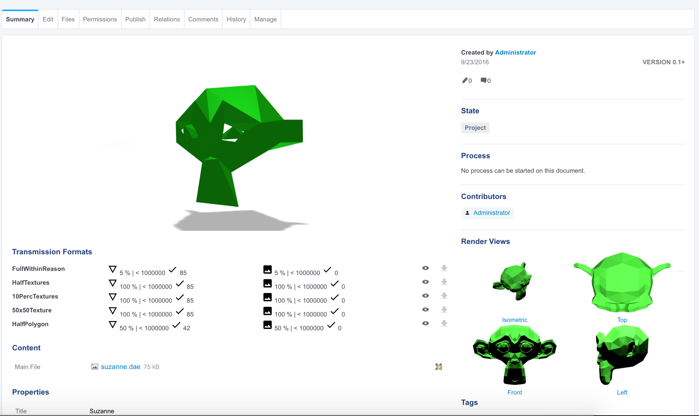

# Nuxeo Platform 3D

Support for previewing 3D content with ray-tracing renders and WebGL 3D viewer.

Requirements: minimum version for Nuxeo Platform is 8.3.

Supported 3D file formats:

* Collada (.dae)
* 3D Studio (.3ds)
* FBX (.fbx)
* Stanford (.ply)
* Wavefront (.obj)
* X3D Extensible 3D (.x3d)
* Stl (.stl)

# Building

    mvn clean install

# Installation

## Server-side

Copy the 5 built artifacts into `$NUXEO_HOME/templates/custom/bundles/`

## Client-side

### Step 1: Install Blender
Install it directly from `https://www.blender.org/download/`.
Add it to your PATH On Mac OS: `PATH=$PATH:/Applications/:/Applications/blender.app/Contents/MacOS`

### Step 2: Install collada2gltf
Install it directly from `https://github.com/KhronosGroup/glTF/releases/download/v1.0-draft2/collada2gltf_mac_v1.0-draft_x64.gz`
and add it to `/usr/bin`.
Make collada2gltf accessible with a command line.

# How to use it
Create a new document type "3D".
Then add to the main content the ".obj" document and all other formats as attached files.

Available features: 
- Preview your 3D asset
- List of downloadable transmission formats
- Render views available on the right panel

# QA results

# About Nuxeo

Nuxeo dramatically improves how content-based applications are built, managed and deployed, making customers more agile, innovative and successful. Nuxeo provides a next generation, enterprise ready platform for building traditional and cutting-edge content oriented applications. Combining a powerful application development environment with SaaS-based tools and a modular architecture, the Nuxeo Platform and Products provide clear business value to some of the most recognizable brands including Verizon, Electronic Arts, Sharp, FICO, the U.S. Navy, and Boeing. Nuxeo is headquartered in New York and Paris. More information is available at www.nuxeo.com.
