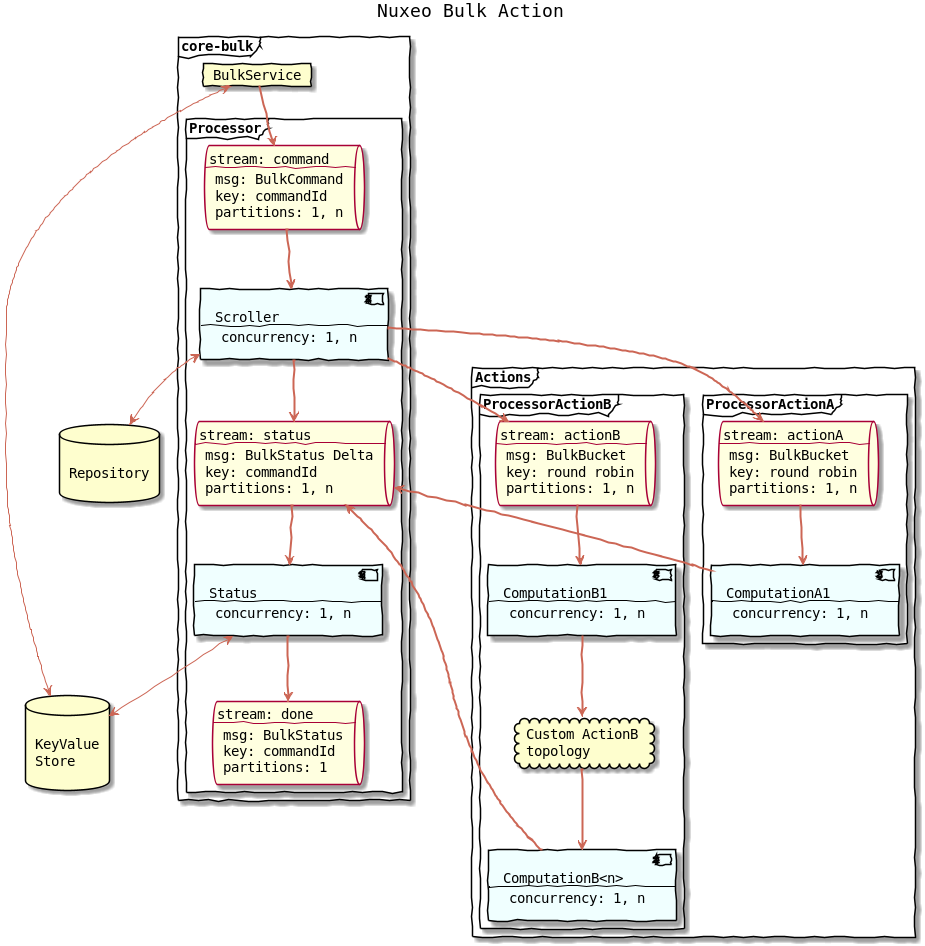

nuxeo-core-bulk
===============

## About

This module provides the ability to execute actions asynchronously on a -possibly large- set of documents. This is done by leveraging [Nuxeo Streams](https://github.com/nuxeo/nuxeo/tree/master/nuxeo-runtime/nuxeo-runtime-stream#nuxeo-runtime-stream) that bring scalability and fault tolerance.

## Definitions


- __document set__: a list of documents from a repository represented as a list of document identifiers.

- __action__: an operation that can be applied to a document set.

- __command__: a set of parameters building a request to apply an action on a document set.

- __bucket__: a portion of a document set that fits into a stream record.

- __batch__: a smaller (or equals) portion of a bucket where the action is applied within a transaction.

## Bulk Command

The bulk command is the input of the framework. It is composed by the user submitting the command, the repository, the NXQL query that materializes the document set, the unique name of the action to execute and some optional parameters that could be needed by the action:

```java
BulkCommand command = new BulkCommand().withRepository("myRepository")
                                       .withUsername("myUser")
                                       .withQuery("SELECT * from Document")
                                       .withAction("myAction")
                                       .withParam("param1", "myParam1")
                                       .withParam("param2", "myParam2")
```

## Execution flow



### The BulkService
The entry point is the [`BulkService`](./src/main/java/org/nuxeo/ecm/core/bulk/BulkService.java) that takes a bulk command as an input.
The service submits this command, meaning it appends the `BulkCommand` to the `command` stream.

The BulkService can also returns the status of a command which is internally stored into a KeyValueStore.

### The Scroller computation

The `command` stream is the input of the `Scroller` computation.

This computation scrolls the database using a cursor to retrieve the document ids matching the NXQL query.
The ids are grouped into a bucket that fit into a record.

The `BulkBucket` record is appended to the action's stream.

The scroller send command status update to inform that the scroll is in progress or terminated and to set the total number of document in the materialized document set.

### Actions processors

Each action runs its own stream processor (a topology of computations).

The action processor must respect the following rules:

- action must send a status update containing the number of processed documents since the last update.

- the total number of processed documents reported must match at some point the number of documents in the document set.

- action that aggregates bucket records per command must handle interleaved commands.
  This can be done by maintaining a local state for each command.

- action that aggregates bucket records per command should checkpoint only when there no other interleaved command in progress.
  This is to prevent checkpoint while some records are not yet processed resulting in possible loss of record.

An [`AbstractBulkComputation`](./src/main/java/org/nuxeo/ecm/core/bulk/action/computation/AbstractBulkComputation.java) is provided so an action can be implemented easily with a single computation
See [`SetPropertiesAction`](./src/main/java/org/nuxeo/ecm/core/bulk/action/SetPropertiesAction.java) for a simple example.

See The [`CSVExportAction`](./src/main/java/org/nuxeo/ecm/core/bulk/action/CSVExportAction.java) and particularly the [`MakeBlob`](./src/main/java/org/nuxeo/ecm/core/bulk/action/computation/MakeBlob.java) computation for an advanced example.


### The Status computation

This computation reads from the `status` stream and aggregate status update to build the current status of command.
The status is saved into a KeyValueStore.
When the number of processed document is equals to the number of document in the set, the state is changed to completed.
And the computation appends the final status to the `done` stream.

This `done` stream can be used as an input by custom computation to execute other actions once a command is completed.


## How to contribute an action

You need to register a couple action / stream processor :

```xml
<extension target="org.nuxeo.ecm.core.bulk" point="actions">
  <action name="myAction" bucketSize="100" batchSize="20"/>
</extension>
```

```xml
<extension target="org.nuxeo.runtime.stream.service" point="streamProcessor">
  <streamProcessor name="myAction" class="org.nuxeo.ecm.core.bulk.action.MyActionProcessor" logConfig="bulk"
      defaultConcurrency="2" defaultPartitions="4" />
</extension>
```

You can find more info on how to configure a stream processor in the following link:
https://github.com/nuxeo/nuxeo/tree/master/nuxeo-runtime/nuxeo-runtime-stream#stream-processing


### Following Project QA Status

[](https://qa.nuxeo.org/jenkins/job/master/job/nuxeo-master/)

## About Nuxeo
Nuxeo dramatically improves how content-based applications are built, managed and deployed, making customers more agile, innovative and successful. Nuxeo provides a next generation, enterprise ready platform for building traditional and cutting-edge content oriented applications. Combining a powerful application development environment with SaaS-based tools and a modular architecture, the Nuxeo Platform and Products provide clear business value to some of the most recognizable brands including Verizon, Electronic Arts, Sharp, FICO, the U.S. Navy, and Boeing. Nuxeo is headquartered in New York and Paris. More information is available at www.nuxeo.com.
