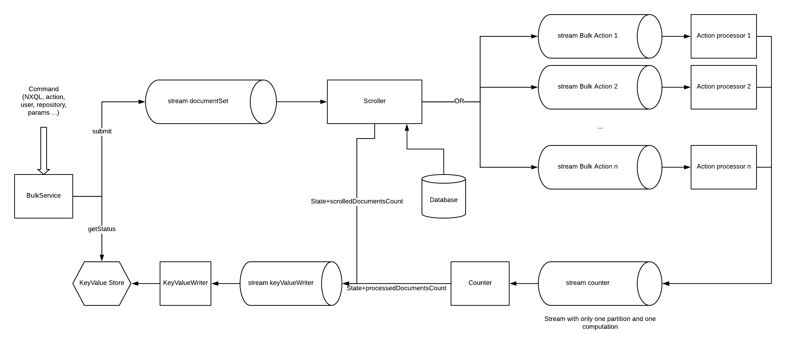

nuxeo-core-bulk
===============

## About

This module provides the ability to execute actions asynchronously on a -possibly large- set of documents. This is done by leveraging [Nuxeo Streams](https://github.com/nuxeo/nuxeo/tree/master/nuxeo-runtime/nuxeo-runtime-stream#nuxeo-runtime-stream) that bring scalability and fault tolerance.

## Definitions

- __document set__: an ensemble of documents represented by their ids.

- __bulk command__: a set of parameters building a request to apply an action on a document set.

- __bucket__: a sub-group of a document set.

- __action__: an operation to be applied on a document set.

## Bulk Command

The bulk command is the input of the framework. It is composed by the user submitting the command, the repository, the NXQL query that materializes the document set, the unique name of the action to execute and some optional parameters that could be needed by the action:

```java
BulkCommand command = new BulkCommand().withRepository("myRepository")
                                       .withUsername("myUser")
                                       .withQuery("SELECT * from Document")
                                       .withAction("myAction")
                                       .withParam("param1", "myParam1")
                                       .withParam("param2", "myParam2")
```

## Execution flow



The entry point is the [BulkService](https://github.com/nuxeo/nuxeo/blob/master/nuxeo-core/nuxeo-core-bulk/src/main/java/org/nuxeo/ecm/core/bulk/BulkService.java) that takes a bulk command as an input. The service submits this command, meaning it is sent to the `documentSet` stream, which is the input of the `Scroller` computation.

This computation scrolls the database to retreive the document ids and groups them into buckets for efficiency. Each bucket is sent to the action stream given in the command.
The computation is also in charge of updating the scrolling status by sending it through the `keyValueWriter` stream to the `KeyValueWriter` computation.

Each action is run by a stream processor defining a single computation which executes the action on the documents contained in the bucket.
The number of processed documents is then sent through a stream to the `Counter` computation which computes and sends the updated command status through the `keyValueWriter` stream to the `KeyValueWriter` computation.

The BulkService can also, with a command id, retrieve its status by reading the key/value store.

## How to contribute an action

You need to register a couple action / stream processor :

```xml
<extension target="org.nuxeo.ecm.core.bulk" point="actions">
  <action name="myAction"/>
</extension>
```

```xml
<extension target="org.nuxeo.runtime.stream.service" point="streamProcessor">
  <streamProcessor name="myAction" class="org.nuxeo.ecm.core.bulk.actions.MyActionProcessor" logConfig="bulk"
      defaultConcurrency="1" defaultPartitions="1">
  </streamProcessor>
</extension>
```

You can find more info on how to configure a stream processor in the following link:
https://github.com/nuxeo/nuxeo/tree/master/nuxeo-runtime/nuxeo-runtime-stream#stream-processing


### Following Project QA Status

[](https://qa.nuxeo.org/jenkins/job/master/job/nuxeo-master/)

## About Nuxeo
Nuxeo dramatically improves how content-based applications are built, managed and deployed, making customers more agile, innovative and successful. Nuxeo provides a next generation, enterprise ready platform for building traditional and cutting-edge content oriented applications. Combining a powerful application development environment with SaaS-based tools and a modular architecture, the Nuxeo Platform and Products provide clear business value to some of the most recognizable brands including Verizon, Electronic Arts, Sharp, FICO, the U.S. Navy, and Boeing. Nuxeo is headquartered in New York and Paris. More information is available at www.nuxeo.com.
