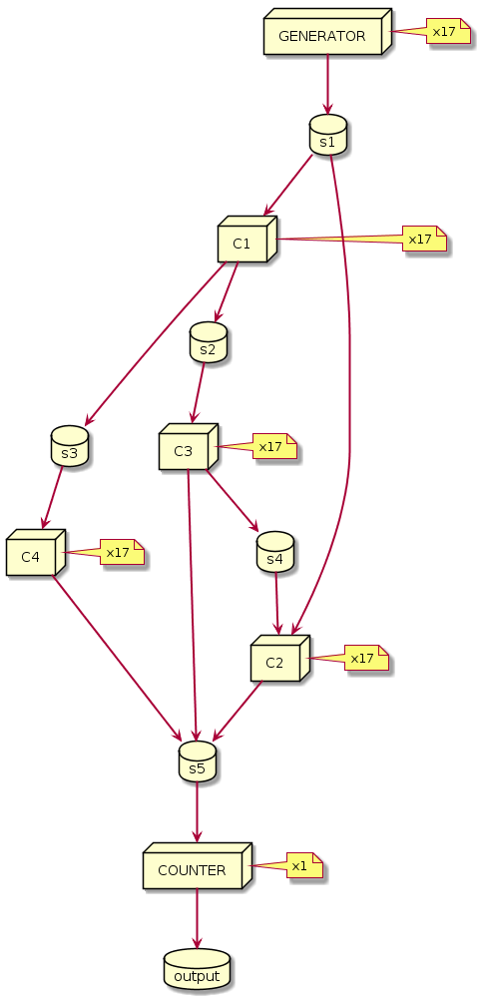

nuxeo-stream
===========================

## About

 This module provides a log based broker message passing system with a computation stream pattern.

 The underlying log solution relies on Chronicle Queue or Kafka.

 This module has no dependency on Nuxeo framework to ease integration with third parties.

## The Log

 A log is a storage abstraction, it is an append only sequence of record ordered by time.
 This simple concept is at the heart of many data intensive applications. It brings fault tolerance, durability, immutability and ordering to distributed system.
 Read [this blog post](https://engineering.linkedin.com/distributed-systems/log-what-every-software-engineer-should-know-about-real-time-datas-unifying) to learn more about the log abstraction.

 To be able to scale a log needs to be partitioned. A partitioned log is an array of logs. Here we call a __Log__ the array and __partition__ the elements of the array.
 The number of partitions in a Log gives the maximal concurrency for a consumer.

 To write a record to a Log a producer needs to acquire an __appender__. The producer is responsible for choosing which record to assign to which partition:

 * Using a round robin algorithm a producer can balance records between partitions. This achieves a load balancing of records between consumers.
 * Using a shard key a producer can deliver ordered records into a partition. Consumers are guaranteed to process records in the exact same order.

 To read records from a Log a consumer needs to create a __tailer__. The tailer doesn't destroy records while reading from a partition.

 A tailer reads records from one or more assigned partitions. A tailer belongs to a consumer __group__.
 For a given group a partition can have at most one tailer, this ensures a tailer receives ordered records, this also limits the
 the maximum concurrency for a Log to the number of its partitions.

 By saving (committing) its offsets a tailer can stop and resume processing without losing records.
 By default a Tailer will read from the last committed offset, but it can also read from the beginning or end of its assigned partitions.

 A tailer can read from multiple partitions, the partitions assignment for a tailer can be static or dynamic.
 - With **static** assignment the tailer explicitly chooses its partitions.
 - With **dynamic** assignment the tailer subscribes to one or more Log, this triggers a rebalancing operation where partitions are assigned to all available consumers of the group.

 Note also that there is no back pressure on the producer because the partitions are unbounded (persisted outside of JVM memory),
 so the producer is never blocked by consumers as long as there is enough disk space.

 The delivery guarantee is at least once, this means that in case of crash a consumer may process multiple times the same record (duplicate).
 Exactly once delivery is not that far if your consumers are idempotent.

### Log implementation

This module is an abstraction layer that enables to use 2 different log implementations: Chronicle Queue and Kafka.

The first implementation is handy for standalone application and is highly efficient,
the second is dedicated for cluster deployment.

#### Chronicle Queue

  [Chronicle Queues](https://github.com/OpenHFT/Chronicle-Queue) is a high performance off-Heap queue library,
  there is no broker to install, it relies entirely on OS memory mapped file.

  Each partition is materialized with a Chronicle Queue.
  There is an additional Chronicle Queue created for each consumer group to persist the consumer's offsets.

  Each partition is persisted on disk and a retention policy can be applied to keep only the last `n` cycles.
  The default retention is to keep the messages of the last 4 days.

  For instance a directory layout for a Log with 4 partitions looks like:
   ```
   basePath                     # The base path of the LogManager
    └── logName                 # The name of the Log
        ├── metadata.properties # Internal metadata about the Log
        ├── P-00                # Chronicle Queue for partition 00
        │   ├── 20171114.cq4    # Cycle for day 2017-11-14
        │   ├── 20171115.cq4
        │   ├── 20171116.cq4
        │   ├── 20171117.cq4
        │   └── metadata.cq4t  # Chronicle queue interal file
        ├── P-01               # Chronicle Queue for partition 01
        │   ├── 20171113.cq4   # Retention keep the last 4 cycles
        │   ├── 20171114.cq4
        │   ├── 20171116.cq4   # There was no record on this partition 2017-11-15
        │   ├── 20171117.cq4
        │   └── metadata.cq4t
        ├── P-02               # Chronicle Queue for partition 02
        │   ├── 20171115.cq4
        │   ├── 20171117.cq4
        │   └── metadata.cq4t
        ├── P-03               # Chronicle Queue for partition 03
        │   ├── 20171116.cq4
        │   ├── 20171117.cq4
        │   └── metadata.cq4t
        └── offset-myGroup     # Chronicle Queue for consumer offset of group myGroup
            ├── 20171114.cq4
            ├── 20171115.cq4
            ├── 20171116.cq4
            ├── 20171117.cq4
            └── metadata.cq4t
  ```

  Note that this implementation has some important limitations:

  - It is limited to a single node because Chronicle Queue can not be distributed using the open source version.
  - The dynamic assignment is not supported, hopefully as we are limited to a single node static assignment is easy to setup.
  - There is no replication, so even if the Log is crash resistant you need to backup the data directory and make sure you never run out of disk.
  - The maximum message size is determined by the Chronicle Queue blockSize which is 4M and enable a message of 1MB.

#### Kafka

  Apache [Kafka](http://kafka.apache.org/) is a distributed streaming platform. Kafka brings distributed support and fault tolerance.

  The implementation is straightforward:
  - A Log is a [Topic](http://kafka.apache.org/intro#intro_topics), a partition is a partition.
  - Appender uses the Kafka [Producer API](http://kafka.apache.org/documentation.html#producerapi) and tailer the Kafka [Consumer API](http://kafka.apache.org/documentation.html#consumerapi).
  - Offsets are managed manually (auto commit is disable) and persisted in an internal Kafka topic.

  You need to install and configure a Kafka cluster, the recommended version is 1.0.x. The Kafka broker needs to be tuned a bit:

  | Kafka broker options | default | recommended |  Description |
  | --- | ---: | ---: | --- |
  | `offsets.retention.minutes` | `1440` | `20160` |The default offset retention is only 1 day, without activity for this amount of time the current consumer offset position is lost and all messages will be reprocessed. To prevent this we recommend to use a value 2 times bigger as `log.retention.hours`, so by default 14 days or `20160`. See [KAFKA-3806](https://issues.apache.org/jira/browse/KAFKA-3806) for more information. |
  | `log.retention.hours` | `168` | |The default log retention is 7 days. If you change this make sure you update `offset.retention.minutes`.|
  | `auto.create.topics.enable` |  `true` |  | Not needed, the topics are explicitly created. |


  Other [consumer and producer options](https://kafka.apache.org/documentation#configuration)
  can be tuned, here are some important options:

  | Consumer options | default | Description |
  | --- | ---: |  --- |
  | `bootstrap.servers` | `localhost:9092` | A list of host/port pairs to use for establishing the initial connection to the Kafka cluster. |
  | `enable.auto.commit` | `false` | The module manages the offset commit this is always set to `false`. |
  | `auto.offset.reset` | `earliest` | This option is always set to `earliest` |
  | `request.timeout.ms` | `30000` | Requests timeout between client and Kafka brokers. |
  | `max.poll.interval.ms` | `300000` | Consumers that don't call poll during this delay are removed from the group. |
  | `session.timeout.ms` | `10000` | Consumers that don't send heartbeat during this delay are removed from the group. |
  | `heartbeat.interval.ms` | `3000` | Interval between heartbeats. |
  | `max.poll.records` | `500` | Can be adjusted to make sure the poll interval is respected. |
  | `group.initial.rebalance.delay.ms` | `3000` | Delay for the initial consumer rebalance. |
  | `subscribe.disable` | `false` | Not a Kafka option, used by the module to disable the dynamic assignment, when this option is `true` LogManager will only support static partition assignment. |

  | Producer options | default | Description |
  | --- | ---: |  --- |
  | `acks` | `1` | The number of acknowledgments the producer requires the leader to have received before considering a request complete. |
  | `compression.type` | `none` | Valid values are none, gzip, snappy, or lz4. Compression is of full batches of data, so the efficacy of batching will also impact the compression ratio (more batching means better compression). |
  | `default.replication.factor` | `1` | Not a Kafka option, used by the module to set the topic replication factor when creating new topic. |


  The maximum message size is limited by Kafka configuration, the default `max.message.bytes` is fixed to 1MB.


## Stream

The Log abstraction can be used directly and provides benefits of a solid asynchronous message passing system.
For instance you can implement a load balance (aka work queue) or a fan out (pub/sub) pattern.

When records processing is expected to give near real time feedback and the number of records is unbounded
we move to stream processing.

This module comes with a computation stream pattern that enables to compose producer/consumer into a complex topology.

This pattern is taken from [Google MillWheel](https://research.google.com/pubs/pub41378.html). A known implementation is [Concord.io](http://concord.io/docs/guides/architecture.html
). The [Kafka Stream Processor](https://github.com/apache/kafka/blob/trunk/streams/src/main/java/org/apache/kafka/streams/processor/Processor.java) API is also similar.

[Computations](http://concord.io/docs/guides/concepts.html) reads from 0 to n streams and writes from 0 to n streams.
A stream is nothing else than a Log in our case.

Records hold some specific fields like a key and a timestamp (watermark) in addition to the content.

The key is used to route the record. Records with the same key are always routed to the same computation instance.

Computations can be composed into a topology. A topology is a directed acyclic graph (DAG) of computations.

The StreamProcessor enables to process a topology of computations in a node. In addition to the topology,
the processor needs some settings to initialize the needed log and define the concurrency on each computation.

Following is an example of a computation stream, the boxes are computations and cylinders are streams.
The dag is defined by the topology and the number of threads and partitions are defined by the settings.



The processing can be distributed in different ways:
 - using the same topology and settings on multiple nodes (machines), it is possible to scale linearly until reaching the number of partitions,
   in this case it is recommended to over provision partitions.
 - you can use the same topology with different settings if you have heterogeneous nodes.
 - you can use different topologies to assign some computation to specific nodes.

The topology/setting can be generated easily using plantuml.

See [TestStreamProcessor](./src/test/java/org/nuxeo/lib/stream/tests/computation/TestStreamProcessor.java) for examples.


## Building

To build and run the tests, simply start the Maven build:

    mvn clean install

### Run Unit Tests with Kafka

 To run the Kafka unit tests you need to use the maven `kafka` profile.
 By default it expects a Kafka broker running on `localhost:9092`.

 This can be setup using docker compose:

 1. Install [docker-compose](https://docs.docker.com/compose/install/).
 2. Run docker-compose:
 ```
   (cd docker/kafka; docker-compose up -d)
 ```
 3. Run unit tests with the maven `kafka` profile:
 ```
   mvn -nsu -Pkafka test
 ```
 4. Stop docker-compose:
 ```
   (cd docker/kafka; docker-compose down)
 ``` 

 To use an existing Kafka cluster use the following options:
 ```
   mvn -nsu test -Pkafka -Dkafka.bootstrap.servers=my-kafka-cluster:9092
 ```

### Run Unit Tests with Confluent Platform

  The [Confluent Platform](https://www.confluent.io/product/confluent-platform/) runs a Kafka with additional services, 
  
  Nuxeo supports the [Confluent Avro Schema Registry](https://docs.confluent.io/current/schema-registry/docs/index.html) to encode its streams.
  
  The Confluent Platform can be run using docker-compose:

1. Install [docker-compose](https://docs.docker.com/compose/install/).

2. Run docker-compose:
  ```
  (cd docker/confluent-kafka; docker-compose up -d)
  ```
3. Run unit tests with the maven `kafka` and `confluent` profile:
  ```
  mvn -nsu -Pkafka,confluent test
  ```
4. Stop docker-compose:
 ```
   (cd docker/confluent-kafka; docker-compose down)
 ``` 


To use an existing Confluent schema registry, use the following options:
 ```
   mvn -nsu test -Pconfluent -Dconfluent.schema_registry.urls=http://my-schema-registry:8081
 ```


### Following Project QA Status
[](https://qa.nuxeo.org/jenkins/job/master/job/nuxeo-master/)


## About Nuxeo
Nuxeo dramatically improves how content-based applications are built, managed and deployed, making customers more agile, innovative and successful. Nuxeo provides a next generation, enterprise ready platform for building traditional and cutting-edge content oriented applications. Combining a powerful application development environment with SaaS-based tools and a modular architecture, the Nuxeo Platform and Products provide clear business value to some of the most recognizable brands including Verizon, Electronic Arts, Sharp, FICO, the U.S. Navy, and Boeing. Nuxeo is headquartered in New York and Paris. More information is available at www.nuxeo.com.
