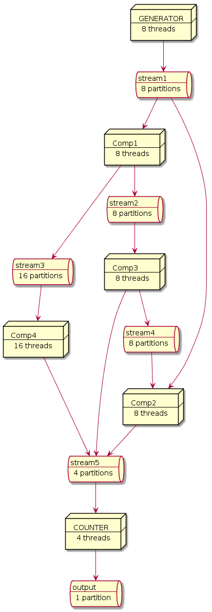

nuxeo-mqueues-core
===========================

## About

 This module implements an asynchronous message passing system called MQueue.

 MQueue is used in different producer consumer patterns described below.

 This module has no dependency on Nuxeo framework to ease integration with third parties.

## Warning

  This module is under development and still experimental, interfaces and implementations may change until it is announced as a stable module.

## MQueue

### Features

 A MQueue can be seen as an array of queues, MQueue stands for Multi Queue.

 A MQueue acts as a partitioned queue, queues that are part of a MQueue are called __partitions__.

 To write to a MQueue a producer need to acquire an __appender__. The producer is responsible for choosing which message to assign to which partition:

 * Using a round robin algorithm a producer can balance messages between partitions.
 * Using a shard key it can group message by partition following its own semantic.

 There is no back pressure on producer because the partition are unbounded (persisted outside of JVM memory),
 so the producer is never blocked when appending a message.

 To read from a MQueue a consumer need to create a __tailer__. The tailer don't destroy messages while reading from a partition.
 Each partition of a MQueue is an ordered immutable sequence of messages.

 A tailer read message from one or more assigned partitions. It belongs to a consumer __group__.
 which is a name space to store its positions (__offsets__).
 By saving (__commit__) its offsets a consumer group can stop and resume processing without loosing messages.
 By default a Tailer will read from the last committed offset, but it can also read from the beginning or end of its assigned partitions.
 The maximum consumer group concurrency is fixed by the number of partitions of the MQueue (its size).

 Of course it is possible to create different group of consumers that process concurrently the same MQueue at their own speed.

 A tailer can read from multiple partitions (even from different MQueue), the partitions assignment for a tailer can be manual or dynamic.
 - With **manual** assignment the tailer explicitly choose its partitions.
 - With **dynamic** assignment tailer subscribes to MQueues, this trigger a partition rebalancing between the tailers of the consumer group,
 this happens also when a tailer terminates.

 MQueue provides at least once delivery, this means that in case of problem duplicates messages are possible.
 Exactly once delivery is not that far if your consumers are idempotent.

### MQueue Implementations

MQueue is an abstraction layer that enable to use 2 different message queue implementations: Chronicle Queue and Kafka.

The first implementation is handy for standalone application and is highly efficient,
the second is dedicated for cluster deployment.

#### Chronicle Queue

  [Chronicle Queues](https://github.com/OpenHFT/Chronicle-Queue) is a high performance off-Heap queue library,
  there is nothing to install.

  Each partition of a MQueue is materialized with a Chronicle Queue.
  There is an additional Chronicle Queue created for each consumer group to persist consumer's offsets.

  The queues are persisted on disk and a retention policy can be applied to keep only the last `n` cycles.
  The default retention is to keep the messages of the last 4 days.

  For instance a MQueue directory layout for a MQueue with 5 partitions looks like:
   ```
   basePath                    # basePath of the MQManager
    └── queueName              # the name of the MQueue
        ├── offset-default     # directory to hold consumer offsets of default consumer group
        │   └── 20170616.cq4   # chronicle files, one per cycle
        ├── Q-00               # directory for the partition 0
        │   └── 20170616.cq4   # chronicle files
        ├── Q-01
        │   └── 20170616.cq4
        ├── Q-02
        │   └── 20170616.cq4
        ├── Q-03
        │   └── 20170616.cq4
        └── Q-04
            └── 20170616.cq4
  ```

  Note that this implementation has some important limitations:

  - It is limited to a single node because Chronicle Queue can not be distributed using the open source version.
  - The dynamic assignment is not supported, hopefully as we are limited to a single node manual assignment is easy.
  - There is no replication, therefore no fault tolerance. In other word the data directory must be backup and you should make sure you never run out of disk.

#### Kafka

  Apache [Kafka](http://kafka.apache.org/) is a distributed streaming platform. Kafka brings distributed support and fault tolerance.

  The implementation is straightforward:
  - A MQueue is a [topic](http://kafka.apache.org/intro#intro_topics), partitions have the same meaning.
  - Appender uses the Kafka [Producer API](http://kafka.apache.org/documentation.html#producerapi) and tailer the Kafka [Consumer API](http://kafka.apache.org/documentation.html#consumerapi).
  - Offsets are managed manually (auto commit is disable) and persisted in Kafka internal topic.

  You need to install and configure a Kafka cluster, the recommended version is 0.11.0.x. To create topics MQueues need a Zookeeper access, the Kafka broker need to be tuned a bit:

  | Kafka broker options | default | Description |
  | --- | ---: |  --- |
  | `offsets.retention.minutes` | `1440` | The default offset retention is only 1 day, without activity for this amount of time the current consumer offset position is lost and all messages will be reprocessed. To prevent this we recommend to use a value 2 times bigger as `log.retention.hours`, so by default 14 days or `20160`. See [KAFKA-3806](https://issues.apache.org/jira/browse/KAFKA-3806) for more information. |
  | `log.retention.hours` | `168` | The default log retention is 7 days. If you change this make sure you update `offset.retention.minutes`.|
  | `auto.create.topics.enable` |  `true` | This is not a requirement for MQueue, because topic are created from Zookeeper. |


  Other [consumer and producer options](https://kafka.apache.org/documentation#configuration)
  can be tuned, here are some important options:

  | Consumer options | default | Description |
  | --- | ---: |  --- |
  | `bootstrap.servers` | `localhost:9092` | A list of host/port pairs to use for establishing the initial connection to the Kafka cluster. |
  | `enable.auto.commit` | `false` | MQueue manages the offset commit this is always set to `false`. |
  | `auto.offset.reset` | `earliest` | This option is always set to `earliest` |
  | `request.timeout.ms` | `30000` | Requests timeout between MQueue and Kafka brokers. |
  | `max.poll.interval.ms` | `300000` | Consumers that don't call poll during this delay are removed from the group. |
  | `session.timeout.ms` | `10000` | Consumers that don't send heartbeat during this delay are removed from the group. |
  | `heartbeat.interval.ms` | `3000` | Interval between heartbeats. |
  | `max.poll.records` | `500` | Can be adjusted to make sure the poll interval is respected. |
  | `group.initial.rebalance.delay.ms` | `3000` | Delay for the initial consumer rebalance. |
  | `subscribe.disable` | `false` | This is a MQueue only option to disable the dynamic assignment, when this option is `true` MQueue will only support manual partition assignment. |

  | Producer options | default | Description |
  | --- | ---: |  --- |
  | `acks` | `1` | The number of acknowledgments the producer requires the leader to have received before considering a request complete. |
  | `compression.type` | `none` | Valid values are none, gzip, snappy, or lz4. Compression is of full batches of data, so the efficacy of batching will also impact the compression ratio (more batching means better compression). |
  | `default.replication.factor` | `1` | This is a MQueue only option to set the topic replication factor when creating new topic. |


## Producer/Consumer Patterns

MQueue can be used as is and provides benefits of a solid asynchronous message passing system.
 For instance you can impl a work queue or pub/sub on it.

That being said this module comes with battery included for 2 interesting patterns:
- A simple producer/consumer pattern that handle retry and batching
- A computation stream pattern, where we can compose producer/consumer into complex topology

### Simple producer/consumer pattern

#### Queuing with a limited amount of messages

Typical usage can be a mass import process where producers extract documents and consumer import documents:

* it decouples producers and consumers: import process can be run multiple time in a deterministic way for debugging and tuning.
* it brings concurrency in import when producer dispatch messages with a correct semantic and evenly.

For efficiency consumer process message per batch. For reliability consumer follow a retry policy.

This is a one time process:

* Producers end on error or when all message are sent.
* Consumers stop in error (according to the retry policy) or when all messages are processed.

The proposed solution takes care of:

* Driving producers/consumers thread pools
* Following a [consumer policy](./src/main/java/org/nuxeo/lib/core/mqueues/pattern/consumer/ConsumerPolicy.java) that defines:
    - the batch policy: capacity and timeout
    - the retry policy: which exceptions to catch, number of retry, backoff and much more see [failsafe](https://github.com/jhalterman/failsafe) library for more info
    - when to stop and what to do in case of failure
* Saving the consumer's offset when a batch of messages is successfully processed
* Starting consumers from the last successfully processed message
* Exposing metrics for producers and consumers

To use this pattern one must implement a [ProducerIterator](./src/main/java/org/nuxeo/lib/core/mqueues/pattern/producer/ProducerIterator.java) with factories.
Both the producer and consumer implementation are driven (pulled) by the module.

See [TestPatternBoundedQueuing](./src/test/java/org/nuxeo/lib/core/mqueues/tests/pattern/TestPatternBoundedQueuing.java) for basic examples.

#### Queuing unlimited

Almost the same as pattern as above but producers and consumers are always up processing an infinite flow of messages.
There is no Producer interface, a producer just use a MQueue appender to send messages.

The Consumer is driven the same way but its policy is different:

* a consumer will wait forever on new message
* after a failure on the retry policy, the consumer will continue and take the next message
* consumer can be stopped properly using a poison pill message

A producer can wait for a message to be consumed, this can simulate an async call.

See [TestPatternQueueing](./src/test/java/org/nuxeo/lib/core/mqueues/tests/pattern/TestPatternQueuing.java) for basic examples.


### Stream and Computations

This pattern is taken from [Google MillWheel](https://research.google.com/pubs/pub41378.html). A known implementation is [Concord.io](http://concord.io/docs/guides/architecture.html
). The [Kafka Stream Processor](https://github.com/apache/kafka/blob/trunk/streams/src/main/java/org/apache/kafka/streams/processor/Processor.java) API is also similar.

Instead of message we have record that hold some specific fields like the key and a timestamp (watermark) in addition to the payload.

The key is used to route the record. Records with the same key are always routed to the same computation instance.

The computation is defined like in [concord](http://concord.io/docs/guides/concepts.html).

Computation read from 0 to n streams and write from 0 to n streams. A stream is simply a MQueue of record.

Computations can be composed into topology. A topology is a directed acyclic graph (DAG) of computations, that can be executed using a ComputationManager.

Following is an example of a topology used in unit test, where boxes are computations and cylinders are streams).



A default implementation of Computation is provided based on MQueue, a stream is simply a MQueue of Record.

See [TestComputationManager](./src/test/java/org/nuxeo/lib/core/mqueues/tests/computation/TestComputationManager.java) for examples.


## Building

To build and run the tests, simply start the Maven build:

    mvn clean install

### Run Unit Tests with Kafka

 Test with kafka implementation rely on an assumption, if there is no Kafka server running on `localhost` Kafka tests are not launched.

 To setup a Kafka 0.11.0.0 server for testing:
 1. Install [docker-compose](https://docs.docker.com/compose/install/).
 2. Clone the following [docker compose repository](https://github.com/bdelbosc/kafka-docker) and launch docker compose:
 ```
	git clone git@github.com:bdelbosc/kafka-docker.git
	cd ./kafka-docker/
    docker-compose up -d
    # to stop
    docker-compose down
  ```
### Following Project QA Status
[](https://qa.nuxeo.org/jenkins/job/master/job/addon_nuxeo-mqueues-master/)


## About Nuxeo
Nuxeo dramatically improves how content-based applications are built, managed and deployed, making customers more agile, innovative and successful. Nuxeo provides a next generation, enterprise ready platform for building traditional and cutting-edge content oriented applications. Combining a powerful application development environment with SaaS-based tools and a modular architecture, the Nuxeo Platform and Products provide clear business value to some of the most recognizable brands including Verizon, Electronic Arts, Sharp, FICO, the U.S. Navy, and Boeing. Nuxeo is headquartered in New York and Paris. More information is available at www.nuxeo.com.
